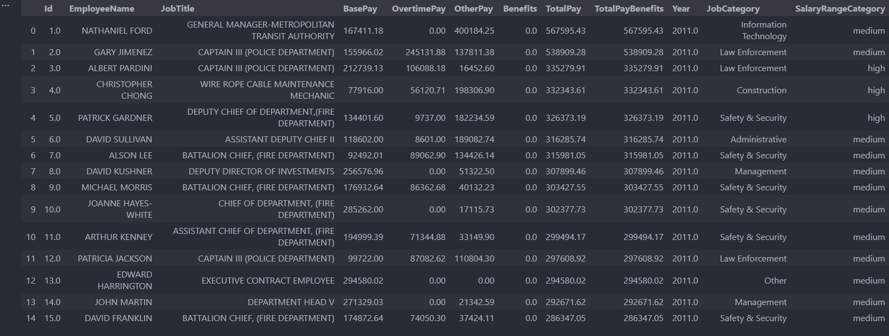

# SFsalaries-ETL-Pipeline

The project takes in a dataset I obtained from Kaggle on salaries based in San Fransisco: https://www.kaggle.com/datasets/kaggle/sf-salaries as a csv file, extract using the extract file, open in transform file where there are multiple transformations ranging from data cleaning, aggregation to engineering, and then loads it into an sqlite file with two tables (transformed data table and an aggregated table).

This project was done to learn about ETL fundamentals while learning about multiple other things listed at the end of README. Throughout this project I have used/learned the following: python, pandas, regex, jupyter notebook, unit testing, sqlite, & ETL workflow.

## Installation
Create a conda environment and install the dependencies using requirements.txt file, then activate the environment:

```shell
$ conda create --name myenv --file requirements.txt
$ conda activate myenv
```

## Previews
### Raw data


### Complete data (Basic and aggregated)



### Pipeline.py output in terminal

